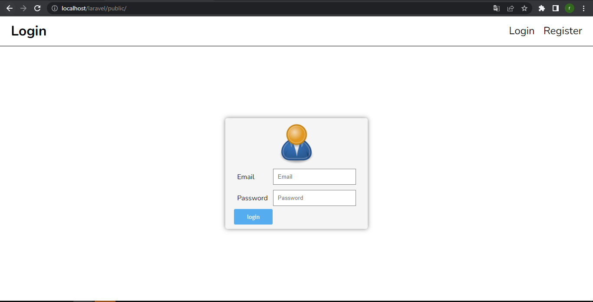
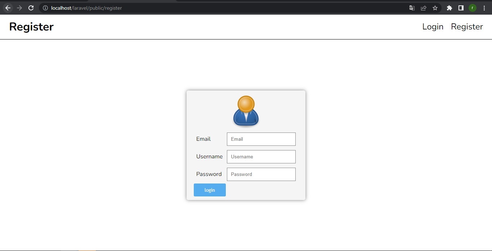
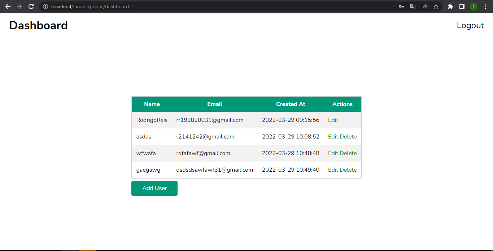

<h1>Laravel - Crud</h1>

    CRUD - Laravel - Aplicação 1ª Semana

<h2>Login</h2>
  

<h2>Register</h2>

<h2>Dashboard</h2>
  
"# Laravel" 
"# Laravel" 
"# Laravel_Crud" 
"# Laravel_Crud" 
"# laravel_crud-app1" 
"# laravel-crud-app" 
"# Laravel-Crud-Master-Mesquita" 
"# Laravel-Aplication-Crud" 
"# Laravel-Application-Crud" 
